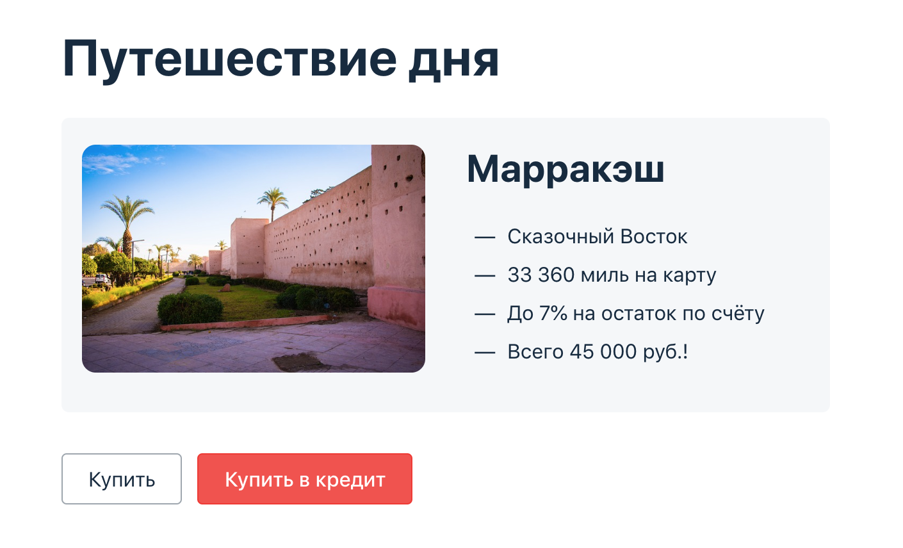

# Дипломный проект по профессии «Тестировщик»

Дипломный проект — автоматизация тестирования комплексного сервиса, взаимодействующего с СУБД и API Банка.

## Как задавать вопросы руководителю по дипломной работе

1. Если у вас возник вопрос, попробуйте сначала самостоятельно найти ответ в интернете. Навык поиска информации пригодится вам в любой профессиональной деятельности. Если ответ не нашёлся, можно уточнить у руководителя по дипломной работе.
2. Если у вас набирается несколько вопросов, присылайте их в виде нумерованного списка. Так дипломному руководителю будет проще отвечать на каждый из них.
3. Для лучшего понимания контекста прикрепите к вопросу скриншоты и стрелкой укажите, что именно вызывает вопрос. Программу для создания скриншотов можно скачать [по ссылке](https://app.prntscr.com/ru/).
4. По возможности задавайте вопросы в комментариях к коду.
5. Формулируйте свои вопросы чётко, дополняя их деталями. На сообщения «Ничего не работает», «Всё сломалось» дипломный руководитель не сможет дать комментарии без дополнительных уточнений. Это затянет процесс получения ответа. 
6. Постарайтесь набраться терпения в ожидании ответа на свои вопросы. Дипломные руководители Нетологии – практикующие разработчики, поэтому они не всегда могут отвечать моментально. Зато их практика даёт возможность делиться с вами не только теорией, но и ценным прикладным опытом.  

Как правильно оформлять вопросы: 

1. Опубликовать последнюю версию вашего кода на GitHub.
2. Включить в репозитории Issues.
3. Завести новое Issue, в котором описать, в чём заключается проблема, и приложить скриншот.
4. Если в консоли любого сервиса есть ошибки, сообщите о них тоже, скопировав текст ошибки.  

Рекомендации по работе над дипломом:

1. Не откладывайте надолго начало работы над дипломом. В таком случае у вас останется больше времени на получение рекомендаций от руководителя и доработку диплома.
2. Разбейте работу над дипломом на части и выполняйте их поочерёдно. Вы будете успевать учитывать комментарии от руководителя и не терять мотивацию на полпути.

## Описание приложения

### Бизнес-часть

Приложение представляет из себя веб-сервис.

Приложение предлагает купить тур по определённой цене двумя способами:

1. Обычная оплата по дебетовой карте.
2. Уникальная технология: выдача кредита по данным банковской карты.

Само приложение не обрабатывает данные по картам, а пересылает их банковским сервисам:
* сервису платежей, далее Payment Gate;
* кредитному сервису, далее Credit Gate.

Приложение в собственной СУБД должно сохранять информацию о том, каким способом был совершён платёж и успешно ли он был совершён. При этом данные карт сохранять не допускается.

*Важно: в реальной жизни приложение не должно даже пропускать данные карт через себя, если у него нет PCI DSS, но мы сделали именно так 😈.*

### Техническая часть

Само приложение расположено в файле [`aqa-shop.jar`](aqa-shop.jar) и запускается стандартным способом `java -jar aqa-shop.jar` на порту 8080.

В файле [`application.properties`](application.properties) приведён ряд типовых настроек:
* учётные данные и url для подключения к СУБД;
* url-адреса банковских сервисов.

### СУБД

Заявлена поддержка двух СУБД. Вы это должны проверить:

* MySQL;
* PostgreSQL.

Учётные данные и url для подключения задаются в файле [`application.properties`](application.properties).

### Банковские сервисы

Доступ к живым банковским сервисам вам не дают, поэтому разработчики подготовили симулятор банковских сервисов, который может принимать запросы в нужном формате и генерировать ответы.

Симулятор написан на Node.js, поэтому для запуска вам нужен либо Docker, либо установленный Node.js. Симулятор расположен в каталоге [gate-simulator](gate-simulator). Для запуска нужно перейти в этот каталог. 

Запускается симулятор командой `npm start` на порту 9999.

Симулятор позволяет генерировать предопределённые ответы для заданного набора карт.

Набор карт представлен в формате JSON в файле [`data.json`](gate-simulator/data.json).

Обратите внимание, разработчики сделали один сервис, симулирующий и Payment Gate, и Credit Gate.

## Задача

Ваша ключевая задача — автоматизировать сценарии покупки тура, как позитивные, так и негативные.

Задача разбита на 4 этапа:

1. Планировании автоматизации тестирования.
2. Непосредственно сама автоматизация.
3. Подготовке отчётных документов по итогам автоматизированного тестирования.
4. Подготовка отчётных документов по итогам автоматизации.

Все материалы — документы, авто-тесты, открытые issue, отчёты и т. д. — должны быть размещены в одном публичном репозитории, ссылку на который вы и будете отправлять дипломному руководителю.

### Планирование

В течение трёх дней с момента начала написания диплома вы должны отправить дипломному руководителю личным сообщением в Discord план автоматизации, в котором описаны:

* перечень автоматизируемых сценариев;
* перечень используемых инструментов с обоснованием выбора;
* перечень и описание возможных рисков при автоматизации;
* интервальная оценка с учётом рисков в часах;
* план сдачи работ: когда будут готовы авто-тесты, результаты их прогона и отчёт по автоматизации.

Отчёт оформляется в виде файла с именем `Plan.md` и заливается в репозиторий вашего проекта.

### Автоматизация

На этом этапе вы пишете авто-тесты и прогоняете их. Требования по подключению CI нет, но есть требования к самим тестам:

* обязательно должны быть тесты UI;
* обязательно должны быть репорты (Gradle/Allure/Report Portal);
* обязательно должны быть запросы в базу, проверяющие корректность внесения приложением информации.

Код авто-тестов заливается в репозиторий вашего проекта вместе с отчётными документами, всеми файлами и конфигурациями, необходимыми для запуска.

В файле `README.md` должна быть описана процедура запуска авто-тестов. Если для запуска необходимо заранее установить, настроить, запустить какое-то ПО — это тоже должно быть описано.

**Важно: если после `git clone` и выполнения шагов, описанные в `README.md` авто-тесты не запускаются, то диплом отправляется на доработку.**

### Отчётные документы по итогам тестирования

В качестве отчётных документов прикладываются issue со скриншотами и описанием багов, формируется документ `Report.md`, в котором содержится отчёт о проведённом тестировании:

* краткое описание;
* количество тест-кейсов;
* процент успешных и не успешных тест-кейсов;
* общие рекомендации.

Не забудьте, помимо документа в систему автоматизации должны быть интегрированы отчёты: Gradle, Allure или Report Portal.

### Отчётные документы по итогам автоматизации

В качестве отчётных документов формируется документ `Summary.md`, в котором содержится отчёт о проведённой автоматизации:

* что было запланировано и что было реализовано;
* причины, по которым что-то не было реализовано;
* сработавшие риски;
* общий итог по времени: сколько запланировали и сколько выполнили с обоснованием расхождения.

## О документах

Важно: когда мы просим вас подготовить разные документы, достаточно составить текст, объёмом не больше страницы A4.

## О требованиях

Во время работы над дипломом важно прислушиваться к дипломному руководителю и к его рекомендациям. Он будет ставить задачи, которые нужно выполнять для достижения лучших результатов обучения. В его интересах также ваше успешное прохождеие курса и получение диплома о его завершении.

## Expert Level

*Важно: выполнение или не выполнение этого раздела не влияет на получение диплома.*

Если вы чувствуете в себе силы, мы предлагаем вам попробовать интегрировать всю систему с Appveyor CI/GitHub Actions или любой другой CI.

Немного подсказок:

* на большинстве CI есть Docker и, возможно, даже Docker Compose;
* на большинстве CI либо предустановлены Node.js, MySQL, PostgreSQL, либо их можно установить;
* вы можете вставлять простейшие `sleep`'ы прямо в сценариях командной строки, чтобы дать «подняться» СУБД, SUT или симулятору. Хотя есть и техники получше.

Если вы это сделаете, не забудьте выставить бейджик сборки.

## Спойлеры

   
Спойлеры

   Смотреть спойлеры не хорошо 😈!

   Раз уж вы посмотрели, то вот вам подсказки:
    
   1. Приложение усыпано багами: от безобидных до супер-критичных. Если вы не нашли ни одного, значит, плохо искали :)
   2. Если есть баги, то тесты не должны быть зелёными.
   3. Если есть баги, то должны быть баг-репорты в issue.
   4. Обращайте внимание на все баги. Особенно внимательно смотрите на обработку платежей и их фиксацию.

